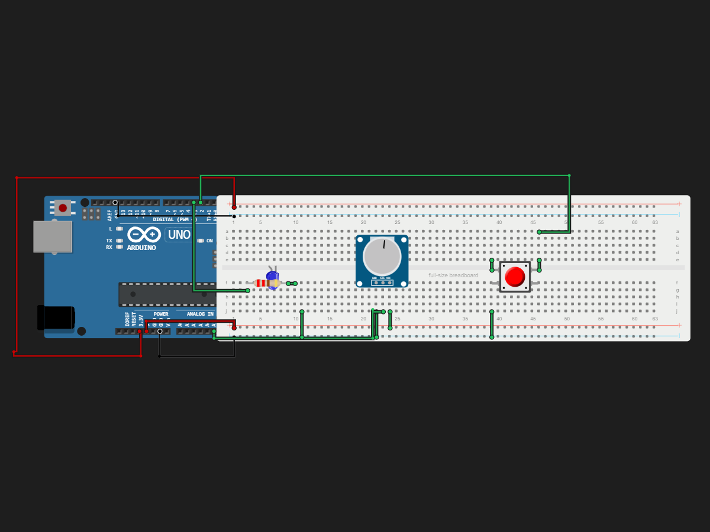

# BreadBoard Tutorial

> Built in [Breadboard](https://breadboard.hackclub.com), a Hack Club program. This project took ~1.9 hours of work.

## What It Does

Turn the knob to set how bright the LED glows, and press the button to switch it on or off. When you turn it back on, it remembers your brightness setting. I might add stuff later on, for ow I just want to learn the basics.

## How It Works

The circuit is captured in `breadboard-project.json`, and the firmware that runs it is in the `firmware/` folder.

## How To Use It

Turn on the LED by pressing the button, then adjust the brightness by turing the pontiometer, brightness amount saves evewn after you turn the LED off.

## Demo

- **Simulate it live:** [https://breadboard.hackclub.com/share/143](https://breadboard.hackclub.com/share/143), runs the firmware in the Breadboard simulator
- **View the design:** [https://taniwankenobi.github.io/breadboard-plays/p/143/](https://taniwankenobi.github.io/breadboard-plays/p/143/)

## Schematic

The editor snapshot is in `breadboard-project.json`.

## Bill of Materials

| Part | Quantity |
| --- | --- |
| breadboard-full | 1 |
| led-blue | 1 |
| potentiometer | 1 |
| pushbutton | 1 |
| resistor-220 | 1 |

## Firmware

Firmware files are in the `firmware/` folder.

## Build Journal

Build journal entries are kept in [`journals.md`](journals.md).

---

*Made in [Breadboard](https://breadboard.hackclub.com) — 1.9h of work*

